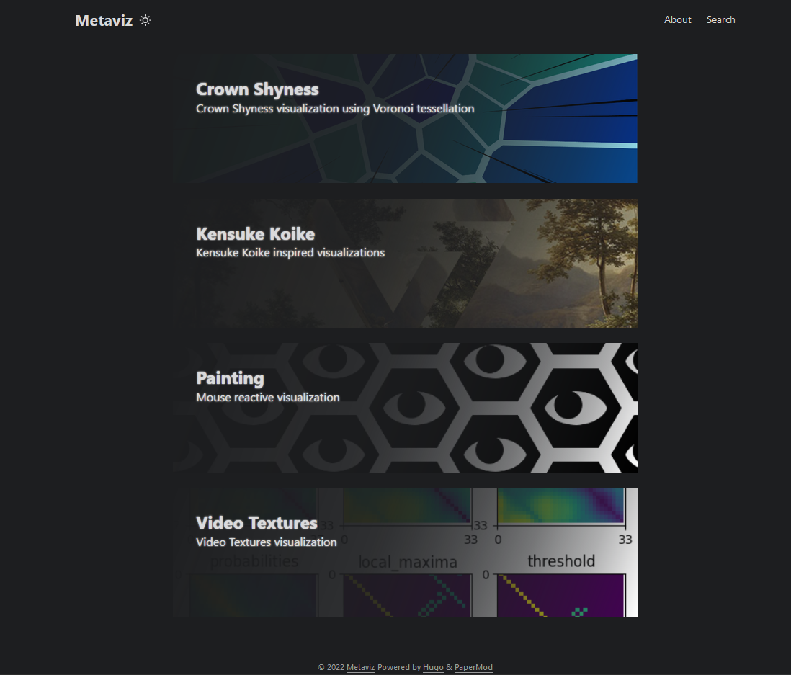
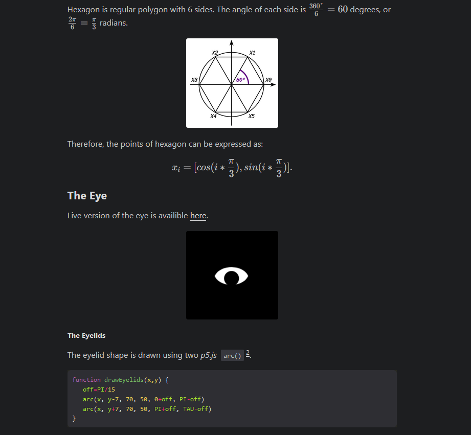
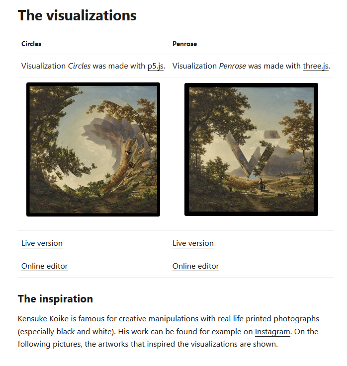
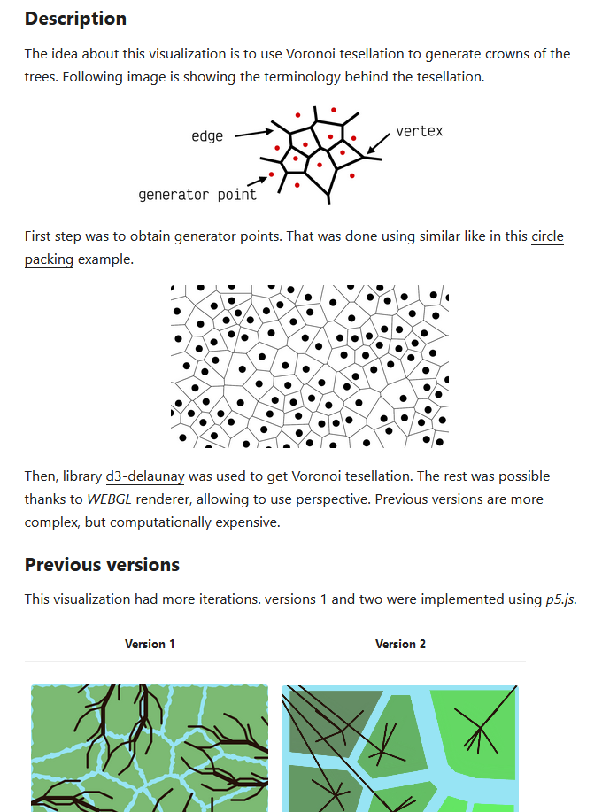

# hugo-metaviz

The aim of *Metaviz* project is to explore the field of creative coding and programming. During this effort, a few visualizations were made. This site should help in their exploration.

### Dark mode preview

  
  

### Light mode preview

  
  

## Resources

Upon the research time a couple of great resources were found. Some of them are listed below.
- List of links
  - [Awesome Creative Coding](https://github.com/terkelg/awesome-creative-coding)
  - [Creative coding algorithms techniques](https://www.notion.so/Creative-coding-algorithms-techniques-c5550ef2f7574126bdc77b09ed76651b)
  - [Morphogenesis resources](https://github.com/jasonwebb/morphogenesis-resources)
  - [Creative Code Streamers (and video makers)](https://www.notion.so/e9239c8529914cd390843f9d05024f48?v=7861cdcf151d47eba0824d3579d368e3)
- Books
  - [The Nature of Code](https://natureofcode.com/book/)
  - [The Book of Shaders](https://thebookofshaders.com)

## Technical information

This site was built with [Hugo](https://gohugo.io/), using template [PaperMod](https://github.com/adityatelange/hugo-PaperMod). Source code for this site is available on [Github](https://github.com/hoskra/hugo-metaviz).

### Usage

- Development
  - run command `hugo serve`
- Static build
  - run command `hugo`
  - output will be at `public/`

### Features

Site is using [KaTeX](https://katex.org/docs/autorender.html) for math rendering.
